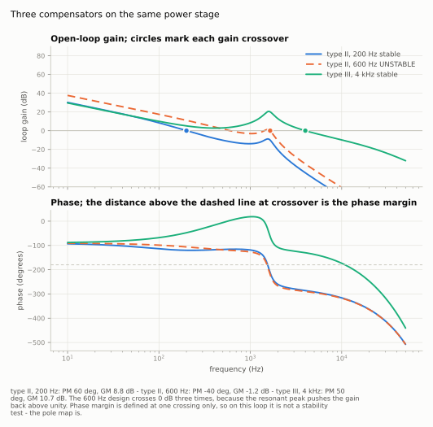
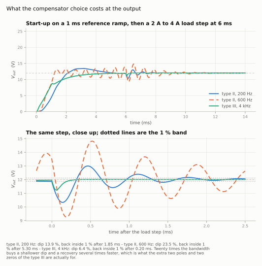
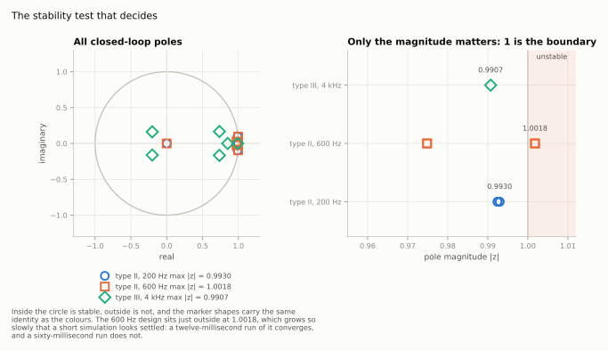
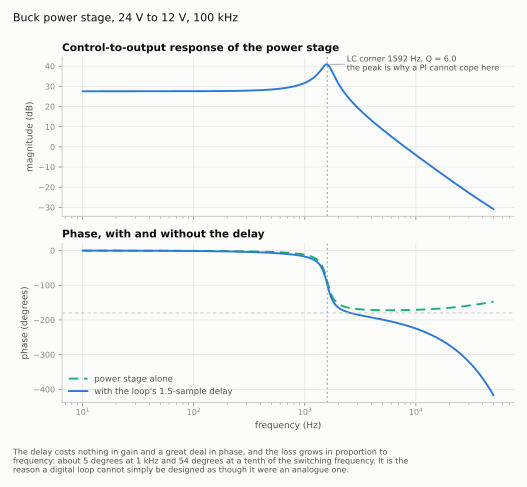
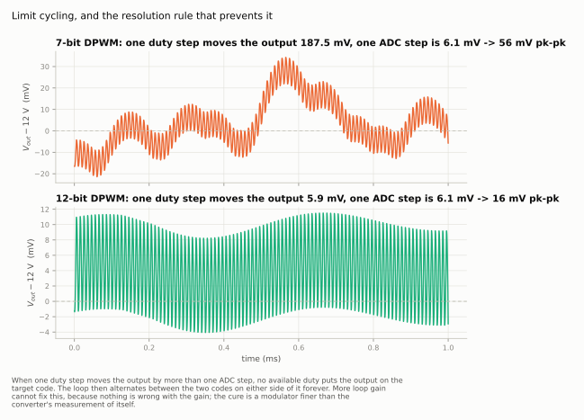
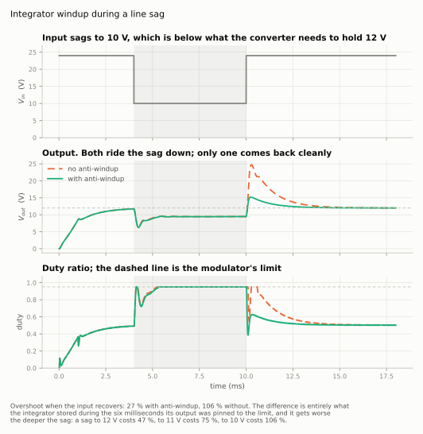
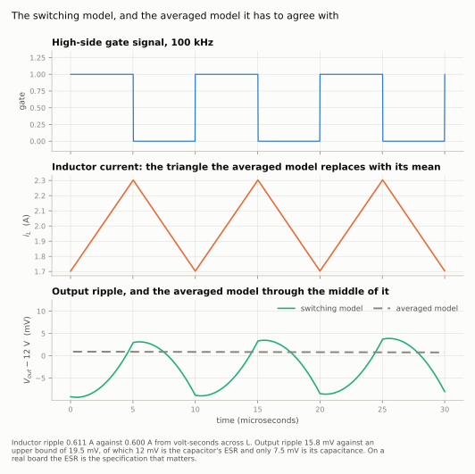

# Digital Buck Converter Control

A synchronous buck converter and the digital voltage loop around it, built as a
block diagram in Python. The compensator is designed on a Bode plot by the
k-factor method, discretised with pre-warped Tustin, and then made to survive a
switching model that quantises the measurement, delays the computation by a
sample, and can only produce the duty ratios a counter can count to.

Everything runs on a laptop. No hardware, no MATLAB licence, no toolbox.

<picture>
  <source media="(prefers-color-scheme: dark)" srcset="figures/loop_bode_dark.svg">
  
</picture>

## The result

24 V to 12 V, 100 kHz, L = 100 µH, C = 100 µF with 20 mΩ of ESR, 2 A nominal.
The output filter corners at 1592 Hz with Q = 6, and its ESR zero sits at
80 kHz — too high to be of any help.

| Compensator | Crossover | Phase margin | Gain margin | max &#124;z&#124; | Load-step dip | Back inside 1 % |
|---|---|---|---|---|---|---|
| Type II | 200 Hz | 60° | 8.8 dB | 0.9930 | 13.9 % | 1.85 ms |
| Type II | 600 Hz | −40° | −1.2 dB | **1.0018** | 23.5 % | never |
| Type III | 4 kHz | 50° | 10.7 dB | 0.9907 | **6.4 %** | **0.20 ms** |

Twenty times the bandwidth halves the dip and recovers nine times faster. That
is what the extra two poles and two zeros of a type III are for, and on a
lightly damped output filter there is no way to get it from a PI.

<picture>
  <source media="(prefers-color-scheme: dark)" srcset="figures/transient_dark.svg">
  
</picture>

## Phase margin is not a stability test here

The middle row of that table is in the project on purpose. Asked for 600 Hz of
bandwidth, the k-factor placement returns a compensator whose Bode plot looks
almost reasonable — and the loop is unstable.

The output filter's resonant peak pushes the loop gain back above unity after
it has already fallen through, so the magnitude crosses 0 dB three times. Phase
margin is defined at one crossing. It says nothing about the other two, and on
this plant it gives the wrong answer.

What settles it is where the closed-loop poles sit once the plant is
discretised with a zero-order hold and the computation delay is included as an
honest z⁻¹:

<picture>
  <source media="(prefers-color-scheme: dark)" srcset="figures/pole_map_dark.svg">
  
</picture>

A pole at 1.0018 grows by 0.18 % per sample. Over a 12 ms simulation it looks
like settling; over 60 ms the output is swinging 32 V peak to peak. **A short
simulation is not a stability proof** — which is the most useful thing in this
repository.

## The delay is the design constraint

A digital loop samples at the top of a switching cycle, and the duty it
computes cannot reach the modulator until the next reload. The modulator then
holds that duty for a full period, which on average delays its effect by half a
period. Together, one and a half sample periods.

<picture>
  <source media="(prefers-color-scheme: dark)" srcset="figures/plant_bode_dark.svg">
  
</picture>

That delay costs nothing in gain and a great deal in phase, and the loss grows
in proportion to frequency: about 5° at 1 kHz and 54° at a tenth of the
switching frequency. Designing without it produces a loop that looks correct on
paper and rings on the bench. It is modelled here as a real `UnitDelay` block
in the diagram, not as a phase correction bolted onto the maths.

It is also what puts a ceiling on crossover. At 5 kHz the k-factor placement
wants a compensator pole at 54 kHz, above the 50 kHz Nyquist frequency, where
it cannot be discretised. `verify.py` checks for that rather than leaving it to
be discovered.

## Three effects that only exist in a digital loop

**The measurement is quantised.** The loop sees ADC codes, not volts. With an
integrator the steady-state error still falls to under one LSB, but no amount
of loop gain removes the dead zone inside one code.

**The duty is quantised too, and that one bites.** If a single duty step moves
the output further than one ADC step, no available duty puts the output on the
target code, and the loop alternates between the two codes either side of it
forever:

<picture>
  <source media="(prefers-color-scheme: dark)" srcset="figures/limit_cycle_dark.svg">
  
</picture>

More gain cannot fix this, because nothing is wrong with the gain. The cure is
a modulator finer than the converter's measurement of itself.

**The integrator winds up when the duty saturates.** Sag the input to 10 V and
the converter cannot hold 12 V at any duty; the output pins to its limit and
stays there. What happens when the input recovers depends entirely on one line
of the difference equation — whether the output history is fed the duty that
was applied or the duty that was asked for:

<picture>
  <source media="(prefers-color-scheme: dark)" srcset="figures/antiwindup_dark.svg">
  
</picture>

Overshoot on recovery is **27 % with anti-windup and 106 % without**, and it
gets worse the deeper the sag: 47 % at a sag to 12 V, 75 % at 11 V, 106 % at
10 V. The compensator is otherwise identical.

## Two models that have to agree

The averaged plant is smooth and linear, and it is the one the compensator is
designed against. The switching plant chops its input at 100 kHz, and it is the
one the design has to survive. They describe the same converter, so they must
agree — and checking that is the cheapest way to catch a modelling mistake that
neither would reveal alone.

<picture>
  <source media="(prefers-color-scheme: dark)" srcset="figures/ripple_dark.svg">
  
</picture>

Through the same load step, the undershoot is 1646 mV in the switching model
and 1643 mV in the averaged one, a difference of 0.2 %.

## Verifying it

`verify.py` runs seventeen checks and exits non-zero if any fail:

```
$ python3 verify.py
  [pass] inductor ripple, pk-pk
         model      0.61116   theory      0.60000   error  +1.860 %
  [pass] type 3: crossover
         model   4000.00004   theory   4000.00000   error  +0.000 %
  [pass] type 3: phase margin
         model     50.00000   theory     50.00000   error  -0.000 %
  [pass] type II at 600 Hz is unstable
         max |z| = 1.0018
  ...
17 checks passed, 0 failed
```

They cover the filter corners, the ripple against volt-seconds across the
inductor, the output ripple against its ESR-plus-capacitance bound, whether
each design actually achieves the crossover and phase margin it was designed
for, whether its poles are implementable below Nyquist, the closed-loop
stability of all three designs, and the agreement between the two plant models.

## Run it

```bash
pip install numpy scipy matplotlib

python3 verify.py         # the seventeen checks, about 20 s
python3 make_figures.py   # rebuilds every figure from the model, about 45 s
```

Designing a compensator for a different target:

```python
from models.buck_blocks import BuckParams
from models.design import design, to_discrete, margins, closed_loop_poles

p = BuckParams(vin=24, vref=12, L=100e-6, C=100e-6, fsw=100e3)
(num, den), rec = design(p, f_cross=3000, pm_deg=55, order=3)
b, a = to_discrete(num, den, p.ts, f_prewarp=3000)

print(margins(p, num, den))          # crossover, phase margin, gain margin
print(closed_loop_poles(p, b, a))    # the answer that actually counts
```

`b` and `a` are the difference-equation coefficients. They are what would be
typed into firmware.

## File layout

```
blockset/core.py          the block-diagram engine: solver, sort, blockset
models/buck_blocks.py     both plants, ADC, DPWM, compensator, soft start
models/buck_model.py      the closed loop, wired up, and its measurements
models/design.py          k-factor placement, Tustin, margins, pole test
models/plotstyle.py       one look for every figure, light and dark
make_figures.py           regenerates figures/
verify.py                 seventeen checks against theory and against itself
```

## Deliberate limitations

- **Voltage mode only.** Peak current mode collapses the plant to first order
  and makes a type II compensator perfectly adequate, which is exactly why it
  is so common. This project models the harder case on purpose.
- **No inductor current limit.** A real converter folds back on current, which
  changes the start-up behaviour and gives the integrator another way to wind
  up.
- **Ideal switches.** No conduction or switching loss, so efficiency is out of
  scope.
- **Fixed load resistance between steps.** A real point-of-load supply feeds a
  processor whose current changes in nanoseconds, faster than any loop can
  respond; the output capacitor handles that, not the compensator.
